# 🚆 TR-PASS 學生版 5日全台鐵道行程實行計畫（板橋起訖・含三餐飲食與備案版）

本計畫專為持有 **TR-PASS 學生版** 之旅客設計，**每天皆為「板橋站出發、當天返回板橋站」**。
每一天行程除具備嚴密的班次銜接與 **應變備案 (Plan B)** 外，更貼心將 **三餐用餐時間（早餐、午餐便當/老街美食、晚餐/夜市）與名店推薦** 完整納入時間規劃中！

---

## 🎯 行程架構總覽

```mermaid
flowchart TD
    subgraph Day1 [Day 1: 西部都會與鐵道古蹟之旅]
        D1A["板橋站 07:40 (買早餐/車上吃)"] --> D1B["台中站 (第二市場/宮原眼科午餐)"]
        D1B --> D1C["彰化站 (扇形車庫/阿三肉圓/爌肉飯)"]
        D1C --> D1D["板橋站 19:55 (板橋環球晚餐)"]
    end

    subgraph Day2 [Day 2: 傳奇環島與南迴海景長征]
        D2A["板橋站 06:15"] --> D2B["枋寮站 (買枋寮便當車上吃)"]
        D2B --> D2C["台東站 ➔ 花蓮站 (莒光號554次/池上便當)"]
        D2C --> D2D["花蓮站 17:30 (東大門夜市晚餐) ➔ 板橋站"]
    end

    subgraph Day3 [Day 3: 東西縱貫秘境雙支線巡禮]
        D3A["板橋站 08:10"] --> D3B["平溪/深澳線 (十分老街小吃/深澳海鮮午餐)"]
        D3B --> D3C["內灣線 (內灣老街客家擂茶/野薑花粽晚餐)"]
        D3C --> D3D["板橋站 19:40/20:45"]
    end

    subgraph Day4 [Day 4: 中部山城懷舊與成追線圓夢]
        D4A["板橋站 07:46"] --> D4B["集集線 (車埕木茶房/車埕便當午餐)"]
        D4B --> D4C["成功/追分 ➔ 彰化站 (彰化貓鼠麵/爌肉飯晚餐)"]
        D4C --> D4D["板橋站 19:40/21:05"]
    end

    subgraph Day5 [Day 5: 宜蘭花東縱谷與太平洋快閃]
        D5A["板橋站 06:50"] --> D5B["花蓮/池上站 (池上悟饕木盒便當午餐)"]
        D5B --> D5C["花蓮站 18:25 (花蓮公正包子/扁食晚餐)"]
        D5C --> D5D["板橋站 21:55/23:00"]
    end
```

---

## 📑 每日詳細實行計畫（含三餐美食與備案）

### 📍 Day 1：西部都會與鐵道古蹟之旅（板橋 ↔ 台中/彰化）

#### 🍱 三餐飲食規劃
- 🥐 **早餐 (07:20)**：板橋車站 B1 洪瑞珍三明治或路易莎咖啡，帶上 **區間快 2011次** 車上享用。
- 🍲 **午餐 (11:30 - 13:00)**：台中站下車，漫步前往 **台中第二市場**（王家菜頭粿糯米腸、山河爌肉飯）或 **宮原眼科/第四信用合作社** 冰淇淋與下午茶。
- 🥩 **晚餐/下午茶 (15:30 - 17:00)**：彰化站出站，走路前往 **阿三肉圓**（酥皮肉圓）或 **彰化魚市爌肉飯**。
- 宵夜：若 19:55 返抵板橋，可於板橋環球購物中心外帶甜點。

#### 主線行程時刻表 (Plan A)
- **07:40 - 09:50** ｜ 搭乘 **區間快 2011次 (EMU900)**：板橋 07:40 ➔ 台中 09:50。（車上吃早餐）
- **10:00 - 13:00** ｜ 台中舊站園區 + **第二市場/宮原眼科享用午餐**。
- **13:08 - 13:20** ｜ 搭乘 **區間車 2173次**：台中 13:08 ➔ 彰化 13:20。
- **13:30 - 17:00** ｜ 參觀彰化扇形車庫 + **品嚐阿三肉圓/爌肉飯晚餐**。
- **17:40 - 19:55** ｜ 搭乘 **區間快 2036次 (EMU900)**：彰化 17:40 ➔ 板橋 19:55 返抵。

#### ⚠️ 應變備案 (Plan B)
- 錯過 2011次 (07:40) 👉 改搭 **自強 109次**（板橋 07:46 ➔ 台中 09:55）。
- 彰化吃太飽延後 👉 改搭 **自強 175次**（彰化 18:20 ➔ 板橋 21:05）。

---

### 📍 Day 2：南迴海景與莒光號長征（板橋 ↔ 枋寮 ↔ 花蓮 ↔ 板橋）

#### 🍱 三餐飲食規劃
- 🥐 **早餐 (06:00)**：板橋站便利商店或台鐵便當本鋪購買台鐵排骨便當/三明治車上吃。
- 🍱 **午餐 (12:40 - 13:00)**：於台東站轉乘 **莒光號 554次** 前，購買 **台東站台鐵便當** 或 **關山便當** 帶上莒光號觀景邊吃！
- 🧋 **晚餐 (17:30 - 18:45)**：莒光554抵達花蓮站後，有 **1小時15分鐘** 充足時間！可搭計程車或步行前往花蓮站前享用 **液香扁食/炸蛋蔥油餅**，或外帶台鐵花蓮特製便當。

#### 主線行程時刻表 (Plan A)
- **06:15 - 10:28** ｜ 板橋 06:15 ➔ 新左營 09:40 (區間快2005) ➔ 枋寮 10:28 (區間快3063)。
- **10:45 - 12:40** ｜ 枋寮 10:45 ➔ 台東 12:40 (區間快3001/莒光727)，看太平洋海景。
- **12:57 - 17:30** ｜ 體驗傳奇 **莒光號 554次**：台東 12:57 ➔ 花蓮 17:30（**車上享用便當午餐**）。
- **17:30 - 18:45** ｜ **【花蓮站前晚餐停留 75 分鐘】**（品嚐花蓮扁食/小吃）。
- **18:50 - 21:55** ｜ 搭乘 **區間快 4030次 (EMU900)**：花蓮 18:50 ➔ 板橋 21:55 返抵。

#### ⚠️ 應變備案 (Plan B)
- 若花蓮吃晚餐不小心花太久 👉 改搭 **自強 177次**（花蓮 19:30 ➔ 板橋 22:45）。

---

### 📍 Day 3：北部雙支線慢活（平溪深澳線 + 內灣線）

#### 🍱 三餐飲食規劃
- 🥐 **早餐 (07:50)**：板橋站外帶早餐。
- 🍢 **午餐 (11:00 - 12:30)**：於 **十分老街** 吃切仔麵、花枝丸、烤香腸；或至 **八斗子/深澳小漁港** 吃小卷米粉。
- 🧋 **下午茶/晚餐 (15:30 - 17:30)**：於 **內灣老街** 享用著名的 **野薑花粽、客家擂茶、紫玉菜包、客家炒板條**。

#### 主線行程時刻表 (Plan A)
- **08:10 - 09:05** ｜ 板橋 08:10 ➔ 瑞芳 09:05。
- **09:25 - 12:30** ｜ 平溪深澳線慢遊（**十分老街享用小吃午餐**）。
- **13:00 - 14:35** ｜ 區間快 2017次：瑞芳 13:00 ➔ 新竹 14:35。
- **14:50 - 18:00** ｜ 內灣線（**內灣老街享用客家晚餐與擂茶**）。
- **18:30 - 19:40** ｜ 搭乘 **區間快 2038次 (EMU900)**：新竹 18:30 ➔ 板橋 19:40 返抵。

#### ⚠️ 應變備案 (Plan B)
- 內灣老街吃太晚 👉 改搭 **區間車 2548次**（新竹 19:15 ➔ 板橋 20:35）。

---

### 📍 Day 4：中部懷舊與成追線圓夢（集集線 + 成功追分）

#### 🍱 三餐飲食規劃
- 🥐 **早餐 (07:30)**：板橋車站買麥當勞或便利商店。
- 🍱 **午餐 (11:30 - 13:00)**：於 **車埕木業園區** 享用特色 **「車埕木茶房木桶便當」**（吃完木桶可帶回家當紀念品）。
- 🍜 **晚餐 (17:00 - 18:00)**：於彰化站/台中站附近品嚐 **彰化貓鼠麵** 或 **彰化爌肉飯**。

#### 主線行程時刻表 (Plan A)
- **07:46 - 10:10** ｜ 搭乘 **自強 109次**：板橋 07:46 ➔ 二水 10:10。
- **10:30 - 14:00** ｜ 集集線 2711次：二水 10:30 ➔ 車埕 11:20（**車埕享用木桶便當午餐**）。
- **14:30 - 16:30** ｜ 成功/追分站（買「追分成功」票卡）。
- **17:00 - 18:00** ｜ **彰化站享用貓鼠麵/爌肉飯晚餐**。
- **18:20 - 21:05** ｜ 搭乘 **自強 175次**（或區間快 2036次 17:40）：彰化 18:20 ➔ 板橋 21:05 返抵。

---

### 📍 Day 5：宜蘭花東縱谷與太平洋快閃（板橋 ↔ 池上 ↔ 花蓮）

#### 🍱 三餐飲食規劃
- 🥐 **早餐 (06:30)**：板橋站麥當勞/飯糰。
- 🍱 **午餐 (12:30 - 13:30)**：到達 **池上站**，於站前購買正宗 **「池上悟饕木盒便當」** 或 **全美行池上便當**，在米鄉池上享用最香Q的米飯！
- 🍧 **下午茶 (15:00)**：池上 **大池豆皮店** 煎豆包與豆漿。
- 🍢 **晚餐 (18:30 - 19:40)**：回抵花蓮站，前往 **花蓮東大門夜市** 或包子名店（**公正包子、周家蒸餃、炸蛋蔥油餅**）。

#### 主線行程時刻表 (Plan A)
- **06:50 - 09:40** ｜ 東線區間快 4003次：板橋 06:50 ➔ 花蓮 09:40。
- **10:00 - 12:25** ｜ 縱谷區間快 4022次：花蓮 10:00 ➔ 池上 12:25。
- **12:30 - 15:50** ｜ **【池上午餐】吃池上木盒便當 + 豆皮店下午茶 + 伯朗大道單車**。
- **16:00 - 18:25** ｜ 區間車 4537次：池上 16:00 ➔ 花蓮 18:25。
- **18:30 - 20:00** ｜ **【花蓮東大門夜市/公正包子享用晚餐】**（停留 90 分鐘）。
- **20:00 - 23:05** ｜ 搭乘 **自強 177次**（或區間快 4030次 18:50）：花蓮 20:00 ➔ 板橋 23:05 返抵。

---

## 🛠️ 飲食與行程驗證

1. **時間完全留足**：每天午晚餐均預留了 **60 至 90 分鐘** 的用餐與休息時間，不會發生「趕車沒時間吃飯」的情況。
2. **結合當地特色鐵道美食**：包含 **池上木盒便當、車埕木桶便當、彰化肉圓爌肉飯、十分老街小吃、內灣客家野薑花粽、花蓮炸蛋蔥油餅/扁食**，讓鐵道之旅同時也是美食之旅！

