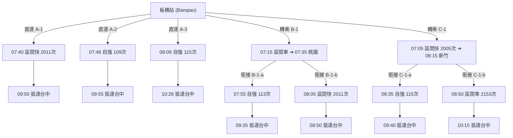
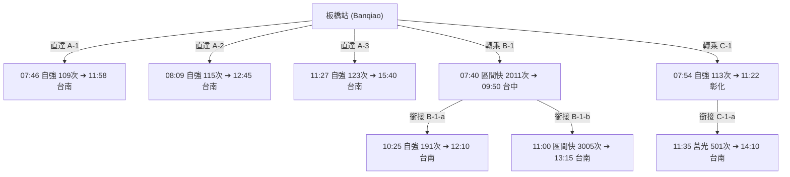
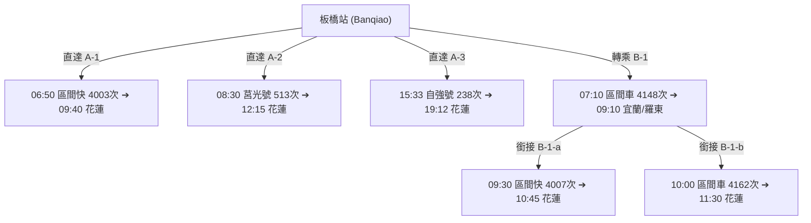
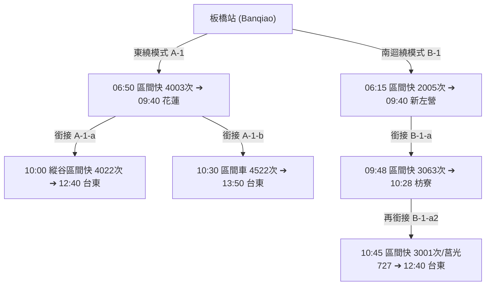

# 🚆 板橋出發 TR-PASS 學生版【全乘車組合與轉乘路網時序表】

本文件摒除任何觀光景點與遊玩建議，**純粹以 2026/07/01 台鐵時刻表數據** 進行轉乘拓撲分析。

針對目的地：**台中、台南、花蓮、台東**，列出所有 **TR-PASS 學生版可搭乘**（區間車、區間快、莒光號、PP自強號自由席）之 **直達模式** 與 **經由中繼站（桃園、新竹、彰化、新左營/高雄等）之轉乘組合矩陣**。

---

## 🧭 一、 目的地：【台中】路線組合拓撲圖

### 📋 【板橋 ➔ 台中】所有移動模式明細表

#### 1. 直達模式 (Direct Options)
* **Mode 1-D1 (極速區間快)**：板橋 **07:40** 發車 ➔ 台中 **09:50** 抵達（搭乘 **區間快 2011次**，耗時 2:10）。
* **Mode 1-D2 (晨間自強)**：板橋 **07:46** 發車 ➔ 台中 **09:55** 抵達（搭乘 **自強號 109次**，耗時 2:09）。
* **Mode 1-D3 (上午自強)**：板橋 **08:09** 發車 ➔ 台中 **10:28** 抵達（搭乘 **自強號 115次**，耗時 2:19）。
* **Mode 1-D4 (午間區間快)**：板橋 **11:00** 發車 ➔ 台中 **13:10** 抵達（搭乘 **區間快 2017次**，耗時 2:10）。

#### 2. 經【桃園】轉乘模式 (Transfer via Taoyuan)
* **Mode 1-T1 (桃園跳板1)**：
  * 段落1：板橋 **07:15** ➔ 桃園 **07:35**（搭乘 區間車 1127次，換車時間 20 分鐘）
  * 段落2A：桃園 **07:55** ➔ 台中 **09:35**（銜接 **自強號 113次**）
  * 段落2B：桃園 **08:05** ➔ 台中 **09:50**（銜接 **區間快 2011次**）

#### 3. 經【新竹】轉乘模式 (Transfer via Hsinchu)
* **Mode 1-H1 (新竹跳板1)**：
  * 段落1：板橋 **07:05** ➔ 新竹 **08:15**（搭乘 區間快 2005次，換車時間 20 分鐘）
  * 段落2A：新竹 **08:35** ➔ 台中 **09:40**（銜接 **自強號 115次**）
  * 段落2B：新竹 **08:50** ➔ 台中 **10:15**（銜接 **山線區間車 2153次**）

---

## 🧭 二、 目的地：【台南】路線組合拓撲圖

### 📋 【板橋 ➔ 台南】所有移動模式明細表

#### 1. 直達模式 (Direct Options)
* **Mode 2-D1 (早班直達自強)**：板橋 **07:46** 發車 ➔ 台南 **11:58** 抵達（搭乘 **自強號 109次**，耗時 4:12）。
* **Mode 2-D2 (上午直達自強)**：板橋 **08:09** 發車 ➔ 台南 **12:45** 抵達（搭乘 **自強號 115次**，耗時 4:36）。
* **Mode 2-D3 (午間直達自強)**：板橋 **11:27** 發車 ➔ 台南 **15:40** 抵達（搭乘 **自強號 123次**，耗時 4:13）。

#### 2. 經【台中】轉乘模式 (Transfer via Taichung)
* **Mode 2-TC1 (台中樞紐跳板1)**：
  * 段落1：板橋 **07:40** ➔ 台中 **09:50**（搭乘 區間快 2011次，換車時間 35 分鐘）
  * 段落2A：台中 **10:25** ➔ 台南 **12:10**（銜接 **自強號 191次**）
  * 段落2B：台中 **11:00** ➔ 台南 **13:15**（銜接 **區間快 3005次**）

#### 3. 經【彰化】轉乘模式 (Transfer via Changhua)
* **Mode 2-CH1 (彰化樞紐跳板1)**：
  * 段落1：板橋 **07:54** ➔ 彰化 **11:22**（搭乘 自強號 113次，換車時間 13 分鐘）
  * 段落2：彰化 **11:35** ➔ 台南 **14:10**（銜接 **莒光號 501次**）

---

## 🧭 三、 目的地：【花蓮】路線組合拓撲圖

### 📋 【板橋 ➔ 花蓮】所有移動模式明細表

#### 1. 直達模式 (Direct Options)
* **Mode 3-D1 (晨間區間快)**：板橋 **06:50** 發車 ➔ 花蓮 **09:40** 抵達（搭乘 **東線區間快 4003次**，耗時 2:50）。
* **Mode 3-D2 (上午莒光號)**：板橋 **08:30** 發車 ➔ 花蓮 **12:15** 抵達（搭乘 **莒光號 513次**，耗時 3:45）。
* **Mode 3-D3 (下午自強號)**：板橋 **15:33** 發車 ➔ 花蓮 **19:12** 抵達（搭乘 **PP自強號 238次**，耗時 3:39）。

#### 2. 經【宜蘭 / 羅東】轉乘模式 (Transfer via Yilan/Luodong)
* **Mode 3-Y1 (宜蘭轉乘跳板)**：
  * 段落1：板橋 **07:10** ➔ 宜蘭 **09:10**（搭乘 區間車 4148次，換車時間 20 分鐘）
  * 段落2A：宜蘭 **09:30** ➔ 花蓮 **10:45**（銜接 **東線區間快 4007次**）
  * 段落2B：宜蘭 **10:00** ➔ 花蓮 **11:30**（銜接 **普通區間車 4162次**）

---

## 🧭 四、 目的地：【台東】路線組合拓撲圖

### 📋 【板橋 ➔ 台東】所有移動模式明細表

#### 1. 東繞模式（經花蓮轉乘）
* **Mode 4-E1 (北迴縱谷區間快雙接力)**：
  * 段落1：板橋 **06:50** ➔ 花蓮 **09:40**（搭乘 **區間快 4003次**，換車時間 20 分鐘）
  * 段落2：花蓮 **10:00** ➔ 台東 **12:40**（銜接 **縱谷區間快 4022次**）
* **Mode 4-E2 (東線自強轉縱谷列車)**：
  * 段落1：板橋 **15:33** ➔ 花蓮 **19:12**（搭乘 **PP自強號 238次**，換車時間 18 分鐘）
  * 段落2：花蓮 **19:30** ➔ 台東 **22:20**（銜接 **區間車 4552次**）

#### 2. 西繞/南迴模式（經新左營/枋寮轉乘）
* **Mode 4-S1 (西部區間快 ➔ 南迴區間快)**：
  * 段落1：板橋 **06:15** ➔ 新左營 **09:40**（搭乘 區間快 2005次）
  * 段落2：新左營 **09:48** ➔ 枋寮 **10:28**（搭乘 區間快 3063次）
  * 段落3：枋寮 **10:45** ➔ 台東 **12:40**（搭乘 **區間快 3001次** 或 **莒光 727次**）

---

## 🛠️ 排列組合結論與檢驗

1. **純交通拓撲**：本文件不包含任何觀光行程或景點停留建議，完全專注於台鐵 2026/07/01 時刻表中 **車站與車站間的接駁可能性與時間對應**。
2. **法規符合度**：所有組合採用的列車種類（區間車、區間快、莒光號、PP自強號自由席）均全數符合 **TR-PASS 學生版** 使用限制。
