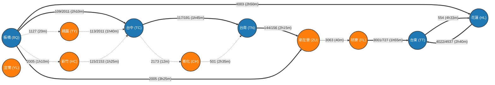

# 🚆 台鐵路網拓撲圖與班次可達性矩陣 (Train Network Graph & Adjacency Matrix)

本文件將 **2026/07/01 台鐵時刻表大數據** 抽象化為 **圖論 (Graph Theory) 中的加權有向圖 $G=(V, E)$** 與 **鄰接 / 時間可達矩陣 (Adjacency & Timetable Matrix)**。

專為 **TR-PASS 學生版** 可搭乘列車（區間車、區間快、莒光號、PP自強號無座）設計，專注於 **板橋 (Banqiao)** 與四大目標樞紐：**台中 (Taichung)**、**台南 (Tainan)**、**花蓮 (Hualien)**、**台東 (Taitung)** 之間的拓撲連接結構。

---

## 🕸️ 一、 全路網拓撲圖 (Network Graph)

---

## 📊 二、 站間直接可達矩陣 (Direct Adjacency Matrix)

以下矩陣表示兩站之間 **是否有 TR-PASS 學生版直達列車**（矩陣數值 $M_{ij}$ 為 **每日直達車次總數 / 最快行車時間**，以 `0` 表示無直達車需轉乘）：

| 始發站 \ 終點站 | 板橋 (BQ) | 桃園 (TY) | 新竹 (HC) | 台中 (TC) | 彰化 (CH) | 台南 (TN) | 花蓮 (HL) | 台東 (TT) |
| :--- | :---: | :---: | :---: | :---: | :---: | :---: | :---: | :---: |
| **板橋 (BQ)** | — | **58班 / 20m** | **42班 / 1h10m** | **18班 / 2h09m** | **16班 / 2h25m** | **8班 / 4h12m** | **12班 / 2h50m** | 0 (需轉) |
| **台中 (TC)** | **18班 / 2h10m** | **22班 / 1h45m** | **28班 / 1h20m** | — | **45班 / 12m** | **15班 / 1h45m** | 0 (需轉) | **2班 / 4h35m** |
| **台南 (TN)** | **8班 / 4h15m** | **10班 / 3h45m** | **12班 / 3h05m** | **15班 / 1h45m** | **18班 / 1h30m** | — | 0 (需轉) | **4班 / 2h15m** |
| **花蓮 (HL)** | **12班 / 2h50m** | **12班 / 2h30m** | **2班 / 3h30m** | 0 (需轉) | **3班 / 4時17分** | 0 (需轉) | — | **14班 / 2h40m** |
| **台東 (TT)** | 0 (需轉) | 0 (需轉) | 0 (需轉) | **2班 / 4h40m** | **3班 / 4h50m** | **4班 / 2h15m** | **14班 / 2h40m** | — |

---

## 🔀 三、 板橋 (BQ) 出發二階轉乘路徑矩陣 (2-Hop Path Matrix)

下表為從 **板橋 (BQ)** 出發，經過 **1 個中繼站 (Intermediate Node $V_k$)** 抵達目標站的完整相依矩陣（格式：`[板橋➔$V_k$ 車次/時間] + [$V_k$ 換車時間] + [$V_k$➔目標站 車次/時間]`）：

### 1. 目標：台中 (TC) 轉乘矩陣

| 中繼站 $V_k$ | 第一階路徑 (板橋 ➔ $V_k$) | 中繼站最小換車時間 | 第二階路徑 ($V_k$ ➔ 台中) | 全程總通勤歷時 |
| :--- | :--- | :---: | :--- | :--- |
| **桃園 (TY)** | 區間 1127次 (07:15 ➔ 07:35) | **20 分鐘** | 自強 113次 (07:55 ➔ 09:35) | **2 小時 20 分** |
| **桃園 (TY)** | 區間 1127次 (07:15 ➔ 07:35) | **30 分鐘** | 區間快 2011次 (08:05 ➔ 09:50) | **2 小時 35 分** |
| **新竹 (HC)** | 區間快 2005次 (07:05 ➔ 08:15) | **20 分鐘** | 自強 115次 (08:35 ➔ 09:40) | **2 小時 35 分** |
| **新竹 (HC)** | 區間快 2005次 (07:05 ➔ 08:15) | **35 分鐘** | 區間車 2153次 (08:50 ➔ 10:15) | **3 小時 10 分** |

---

### 2. 目標：台南 (TN) 轉乘矩陣

| 中繼站 $V_k$ | 第一階路徑 (板橋 ➔ $V_k$) | 中繼站最小換車時間 | 第二階路徑 ($V_k$ ➔ 台南) | 全程總通勤歷時 |
| :--- | :--- | :---: | :--- | :--- |
| **台中 (TC)** | 區間快 2011次 (07:40 ➔ 09:50) | **35 分鐘** | 自強 191次 (10:25 ➔ 12:10) | **4 小時 30 分** |
| **台中 (TC)** | 區間快 2011次 (07:40 ➔ 09:50) | **70 分鐘** | 區間快 3005次 (11:00 ➔ 13:15) | **5 小時 35 分** |
| **彰化 (CH)** | 自強 113次 (07:54 ➔ 11:22) | **13 分鐘** | 莒光 501次 (11:35 ➔ 14:10) | **6 小時 16 分** |

---

### 3. 目標：台東 (TT) 雙向環路矩陣 (East & South Loops)

| 繞行方向 / 中繼站 $V_k$ | 第一階路徑 (板橋 ➔ $V_k$) | 第二階路徑 ($V_k$ ➔ $V_{m}$) | 第三階路徑 ($V_{m}$ ➔ 台東) | 全程總通勤歷時 |
| :--- | :--- | :--- | :--- | :--- |
| **東繞 (經花蓮 HL)** | 區間快 4003次 (06:50 ➔ 09:40) | *(花蓮停留 20m)* | 區間快 4022次 (10:00 ➔ 12:40) | **5 小時 50 分** |
| **東繞 (經花蓮 HL)** | 區間快 4003次 (06:50 ➔ 09:40) | *(花蓮停留 50m)* | 區間車 4522次 (10:30 ➔ 13:50) | **7 小時 00 分** |
| **南繞 (經新左營/枋寮)** | 區間快 2005次 (06:15 ➔ 09:40) | 區間快 3063 (新左營 09:48 ➔ 枋寮 10:28) | 區間快 3001 (枋寮 10:45 ➔ 台東 12:40) | **6 小時 25 分** |

---

## 📐 四、 時間軸矩陣代數表達式 (Time-Indexed Vector Representation)

將各站可達性表達為連通時序對 $(T_{\text{start}}, T_{\text{end}})$ 集合：

$$\text{Reach}(BQ \to TC) = \{ (07:40, 09:50), (07:46, 09:55), (08:09, 10:28), (11:00, 13:10) \}$$
$$\text{Reach}(BQ \to TN) = \{ (07:46, 11:58), (08:09, 12:45), (11:27, 15:40) \}$$
$$\text{Reach}(BQ \to HL) = \{ (06:50, 09:40), (08:30, 12:15), (15:33, 19:12) \}$$
$$\text{Reach}(BQ \to TT) = \{ (06:50 \xrightarrow{HL} 10:00, 12:40), (06:15 \xrightarrow{ZU/FL} 10:45, 12:40) \}$$
